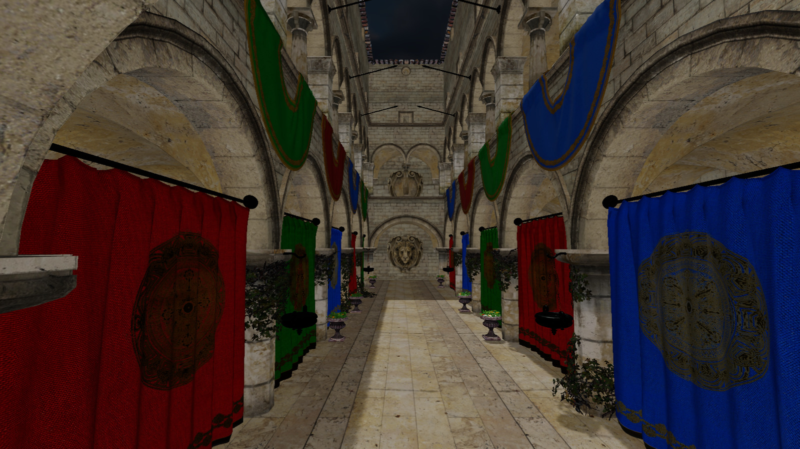
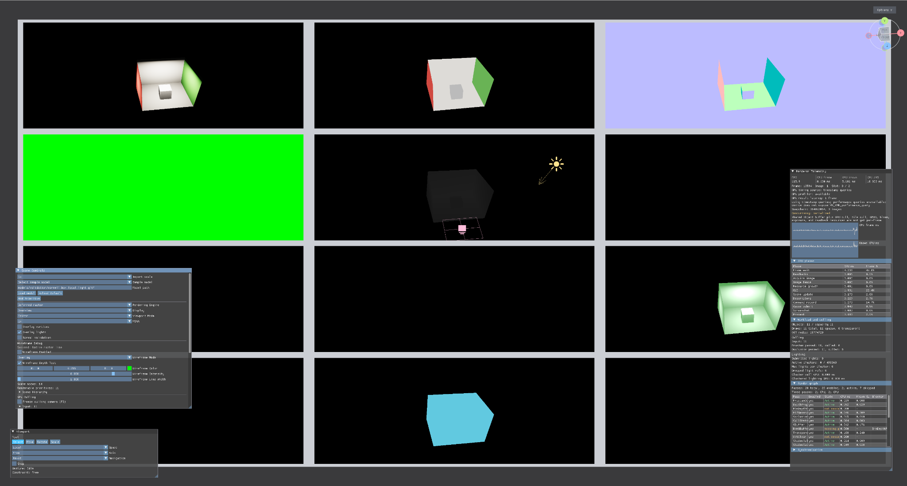
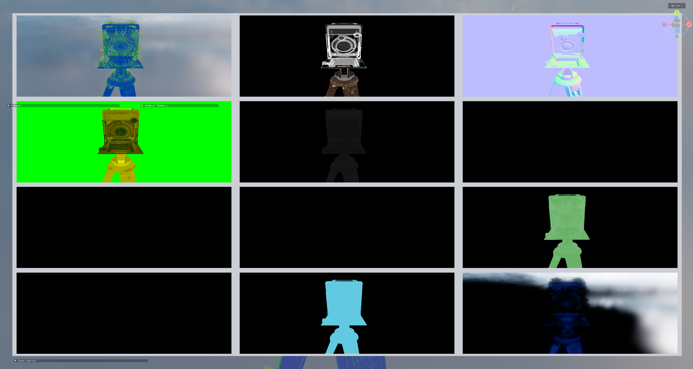
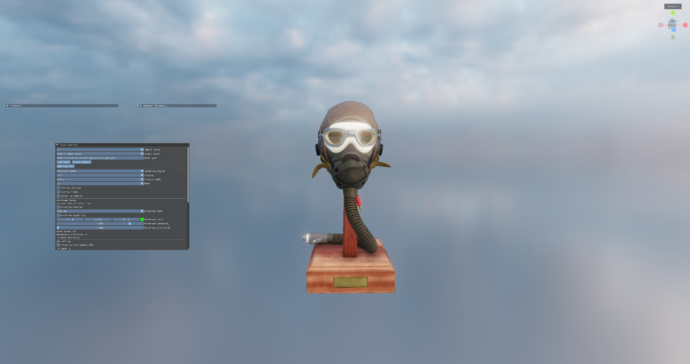
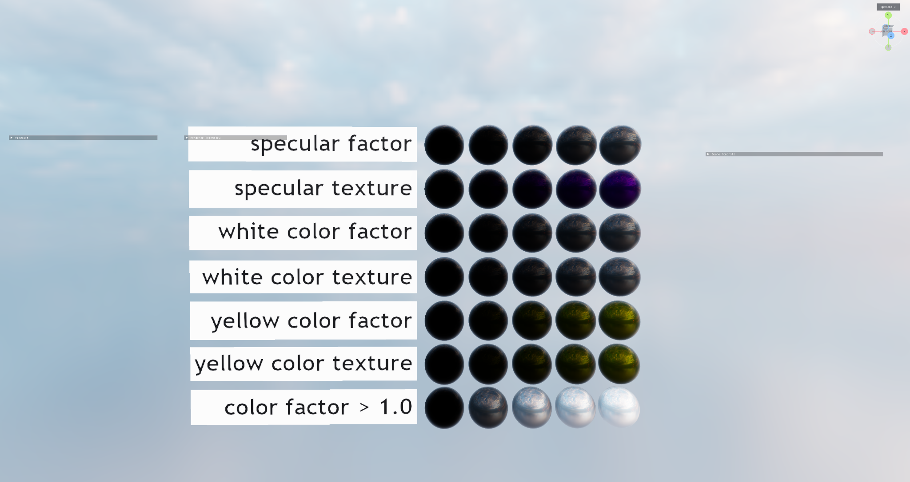
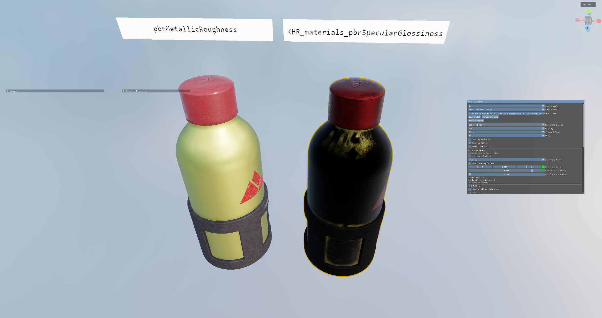
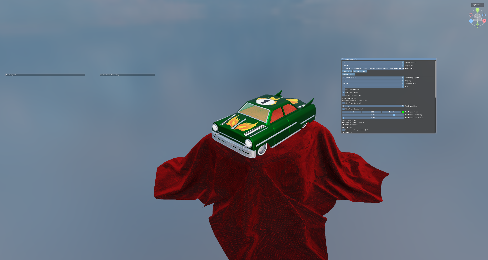

# VulkanSceneRenderer

VulkanSceneRenderer is a C++23 Vulkan renderer for real-time scene rendering,
glTF, BIM, and USD content, physically based materials, shadows,
GPU culling, and debug visualization.

The runtime requires a Vulkan 1.4 GPU and driver. Raster passes use dynamic
rendering and synchronization2; Vulkan-Hpp RAII owns Vulkan objects, VMA owns
GPU allocations, and Slang compiles shaders to SPIR-V 1.6. Forward and deferred
opaque rendering use compute culling and indirect draw counts. See
[the modern rendering architecture](docs/architecture.md#vulkan-14-rendering).

The CMake project and build targets use `VulkanSceneRenderer`. The public
include root remains `include/Container`, and the source namespace remains
`container::`, to avoid a broad source-level API rename.

## Download and Run (Windows x64)

[Download v0.1.0-preview.1](https://github.com/semihguresci/VulkanSceneRenderer/releases/tag/v0.1.0-preview.1)
and select `VulkanSceneRenderer-v0.1.0-preview.1-windows-x64.zip` under **Assets**.
This prerelease is intended for testing and feedback.

Requirements:

- Windows 10 or 11, x64.
- A GPU and current graphics driver supporting Vulkan 1.4. The renderer also
  checks the required descriptor indexing, buffer device address, dynamic
  rendering, synchronization2, and indirect drawing features at startup.
- The [latest Microsoft Visual C++ v14 Redistributable (x64)](https://aka.ms/vc14/vc_redist.x64.exe).

Extract the entire ZIP, then launch `VulkanSceneRenderer.exe` from the extracted
folder. Keep the DLLs and asset folders beside the executable. Visual Studio,
the Vulkan SDK, Slang, Python, and model downloads are not needed to run it.
The package includes precompiled shaders, local sample scenes, and the default
HDR environment. It opens the Cornell box local-light scene using deferred
raster rendering.

From PowerShell in the extracted folder:

```powershell
.\VulkanSceneRenderer.exe
.\VulkanSceneRenderer.exe --model "C:\Models\scene.glb"
.\VulkanSceneRenderer.exe --render-technique forward-raster --msaa 4
```

For `.gltf` files, keep their referenced textures and buffers with the model.
Large gallery scenes and downloaded BIM/USD collections are not bundled.
Validation layers are optional and require the Vulkan SDK when using
`--validation`. The executable is unsigned; Windows may show a download warning.
Verify the archive against the release's `SHA256SUMS.txt` with `Get-FileHash`.
Report testing results through [GitHub Issues](https://github.com/semihguresci/VulkanSceneRenderer/issues),
including the release version, GPU, driver version, launch command, and console
output or a screenshot.

## Gallery

VulkanSceneRenderer supports high-detail scene rendering, physically based
materials, live renderer telemetry, and debug-oriented render target
visualization.



| Debug visualization | Material and scene rendering |
| --- | --- |
|  |  |
|  |  |
|  |  |

## Quick Start

Build from source in a Visual Studio Developer Command Prompt, with
`VCPKG_ROOT` set to your vcpkg checkout and the Vulkan 1.4 SDK installed:

```powershell
cmake --preset windows-release
cmake --build out/build/windows-release --target VulkanSceneRenderer --config Release
```

Visual Studio can open the repository folder and select the `windows-debug` or
`windows-release` CMake preset. For a native Visual Studio solution and Windows
release packaging instructions, see [Build and Test](docs/build-and-test.md).

Run tests:

```powershell
ctest --test-dir out/build/windows-release --output-on-failure
```

Run with a BIM sidecar model:

```powershell
$bim = "models\buildingSMART-IFC5-development\examples\Hello Wall\hello-wall.ifcx"
.\out\build\windows-release\VulkanSceneRenderer.exe --bim-model $bim
```

The sidecar path also accepts USD, USDA, USDC, and USDZ mesh files through the
TinyUSDZ-backed importer:

```powershell
$usd = "models\my_ascii_mesh.usda"
.\out\build\windows-release\VulkanSceneRenderer.exe --bim-model $usd
```

Download the OpenUSD sample models with CMake:

```powershell
cmake --build out/build/windows-release --target download_usd_models --config Release
```

## Documentation

- [Project overview](docs/project-overview.md) - features, repository layout,
  and asset organization.
- [Architecture](docs/architecture.md) - runtime ownership, frame flow, and
  subsystem boundaries.
- [Build and test](docs/build-and-test.md) - requirements, presets, build
  commands, helper scripts, and known test status.
- [Development guide](docs/development-guide.md) - renderer conventions,
  shader/C++ layout contracts, and commenting guidance.
- [MSAA](docs/msaa.md) - forward and deferred raster multisampling configuration,
  render-pass resolves, and render graph boundaries.
- [Renderer telemetry](docs/renderer-telemetry.md) - live frame timing,
  GPU query backends, render graph metrics, and validation commands.
- [Coordinate conventions](docs/coordinate-conventions.md) - source of truth
  for coordinate systems, reverse-Z depth, viewports, culling, and matrix rules.
- [Lighting system plan](docs/lighting-system-improvement-plan.md) - lighting,
  shadows, tiled culling, GTAO, GPU-driven rendering, and bloom rationale.
- [Refactoring plan](docs/refactoring-plan.md) - ownership boundaries,
  dependency cleanup, and render graph direction.
