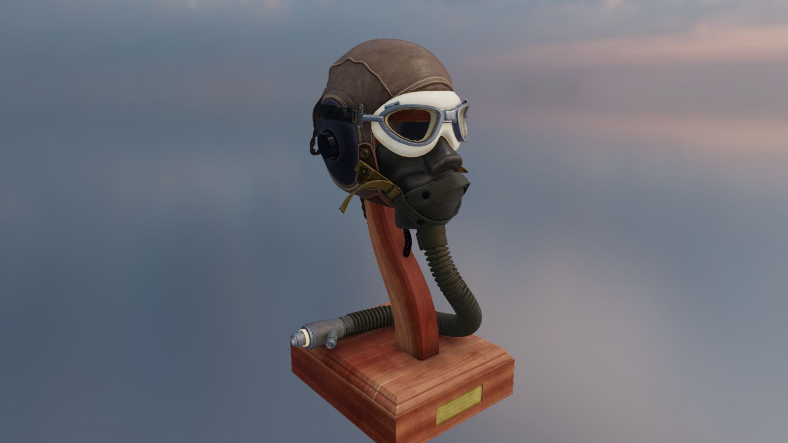
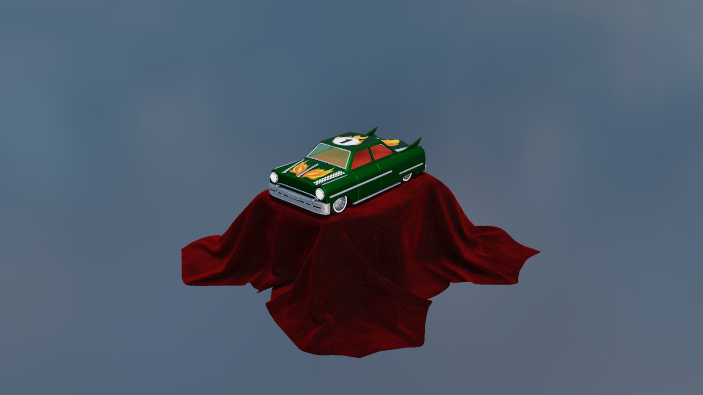
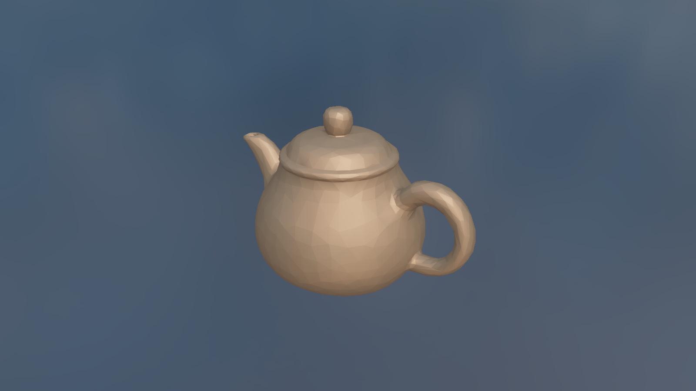
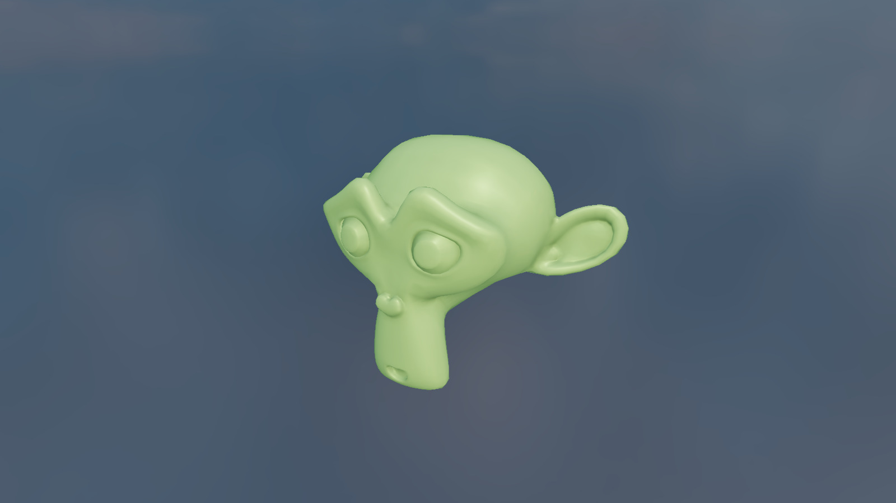
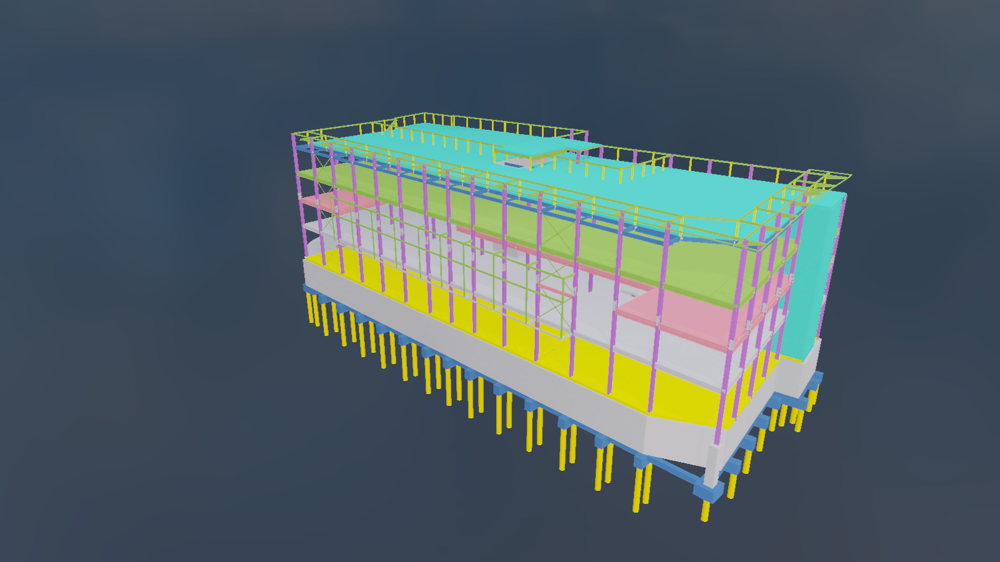
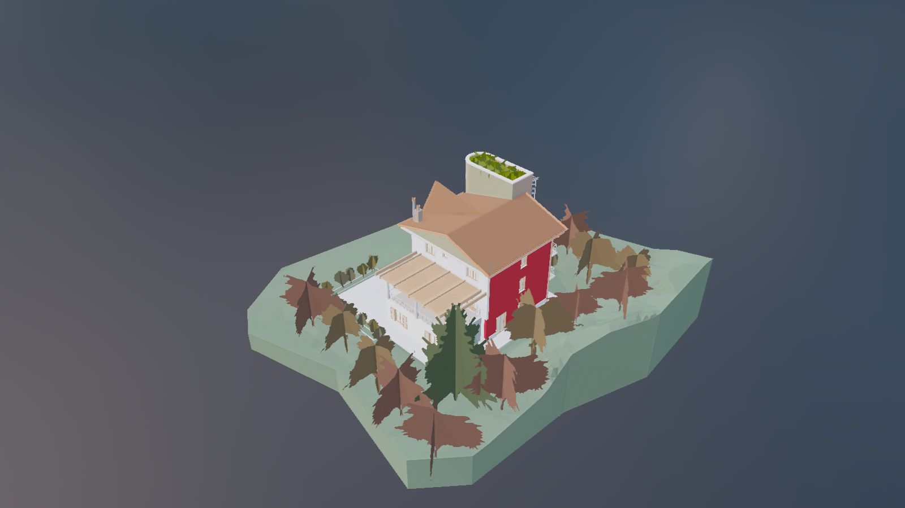
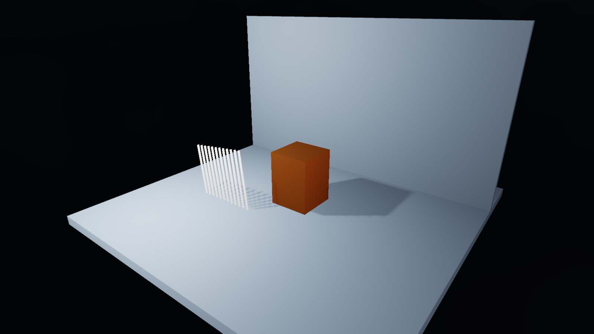
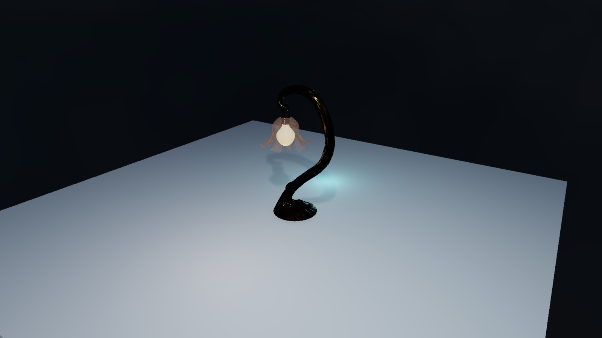
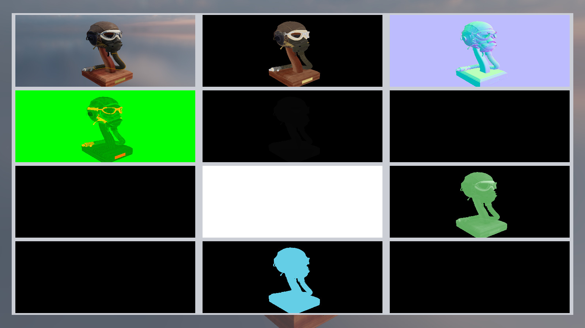

# VulkanSceneRenderer

VulkanSceneRenderer is a C++23 Vulkan renderer for real-time scene rendering,
glTF, BIM, and USD content, physically based materials, shadows,
GPU culling, and debug visualization.

The runtime requires a Vulkan 1.4 GPU and driver. Raster passes use dynamic
rendering and synchronization2; Vulkan-Hpp RAII owns Vulkan objects, VMA owns
GPU allocations, and Slang compiles shaders to SPIR-V 1.6. Forward and deferred
opaque rendering use compute culling and indirect draw counts. See
[the modern rendering architecture](docs/architecture.md#vulkan-14-rendering).

For replayable Vulkan runtime debugging, use the optional
[GFXReconstruct capture/replay workflow](docs/gfxreconstruct.md). It supports
selected frame ranges and runtime hotkeys, with shader/build identities and a
frame journal linking captures to lighting and TAA state. Capture tools are
installed separately; ordinary rendering has no additional dependency.

Optional [ray-query shadows](docs/ray-query-rendering.md) share acceleration
structures across glTF, BIM and USD. Use `--ray-shadows hard` for geometric
directional/local shadows or `--ray-shadows soft --ray-shadow-samples 8` for
filtered rectangle/disk emitters. Raster shadows remain the default and the
fallback on devices without ray-query support. These options require a current
source build or a package produced from this branch; the older TAA preview does
not include them.

The CMake project and build targets use `VulkanSceneRenderer`. The public
include root remains `include/Container`, and the source namespace remains
`container::`, to avoid a broad source-level API rename.

## Download and Run (Windows x64)

[Download the TAA preview](https://github.com/semihguresci/VulkanSceneRenderer/releases/tag/v0.2.0-taa-preview)
and select `VulkanSceneRenderer-0.2.0-taa-preview-windows-x64.zip` under **Assets**.
This prerelease is intended for testing and feedback.

Run `VulkanSceneRenderer.exe --taa --msaa 1 --display-mode lit` to try native HDR
temporal anti-aliasing. Forward rendering also supports TAA with
`--render-technique forward-raster`. See the [measured results and limits](docs/taa-validation.md).

Requirements:

- Windows 10 or 11, x64.
- A GPU and current graphics driver supporting Vulkan 1.4. The renderer also
  checks the required descriptor indexing, buffer device address, dynamic
  rendering, synchronization2, and indirect drawing features at startup.
- The [latest Microsoft Visual C++ v14 Redistributable (x64)](https://aka.ms/vc14/vc_redist.x64.exe).

Extract the entire ZIP, then launch `VulkanSceneRenderer.exe` from the extracted
folder. Keep the DLLs and asset folders beside the executable. Visual Studio,
the Vulkan SDK, Slang, Python, and model downloads are not needed to run it.
The package includes precompiled shaders, local sample scenes, and the default
HDR environment. It opens the Cornell box local-light scene using deferred
raster rendering.

From PowerShell in the extracted folder:

```powershell
.\VulkanSceneRenderer.exe
.\VulkanSceneRenderer.exe --model "C:\Models\scene.glb"
.\VulkanSceneRenderer.exe --render-technique forward-raster --msaa 4
```

For `.gltf` files, keep their referenced textures and buffers with the model.
Large gallery scenes and downloaded BIM/USD collections are not bundled.
Validation layers are optional and require the Vulkan SDK when using
`--validation`. The executable is unsigned; Windows may show a download warning.
Verify the archive against the release's `SHA256SUMS.txt` with `Get-FileHash`.
Report testing results through [GitHub Issues](https://github.com/semihguresci/VulkanSceneRenderer/issues),
including the release version, GPU, driver version, launch command, and console
output or a screenshot.

## Gallery

Fresh captures from VulkanSceneRenderer show textured glTF scenes, USD meshes,
IFCX buildings, point-light shadows, and render target diagnostics. Images use
deferred raster rendering with TAA at 1600 × 900.


| Flight Helmet · glTF PBR materials | Toy Car · glTF textures and reflections |
| --- | --- |
|  |  |

| USD · Teapot (USDC) | USD · Suzanne (USDA) |
| --- | --- |
|  |  |

| BIM · Tekla House (IFCX) | BIM · ACCA Building (IFCX) |
| --- | --- |
|  |  |

| Point-light shadows · Cube and thin blockers | Point-light shadows · Lamp |
| --- | --- |
|  |  |

**Render target diagnostics**



See [model credits and capture settings](docs/images/readme/README.md) for asset
sources and the lighting variants used in the shadow examples.

## Quick Start

Build from source in a Visual Studio Developer Command Prompt, with
`VCPKG_ROOT` set to your vcpkg checkout and the Vulkan 1.4 SDK installed:

```powershell
cmake --preset windows-release
cmake --build out/build/windows-release --target VulkanSceneRenderer --config Release
```

Visual Studio can open the repository folder and select the `windows-debug` or
`windows-release` CMake preset. For a native Visual Studio solution and Windows
release packaging instructions, see [Build and Test](docs/build-and-test.md).

Run tests:

```powershell
ctest --test-dir out/build/windows-release --output-on-failure
```

Run with a BIM sidecar model:

```powershell
$bim = "models\buildingSMART-IFC5-development\examples\Hello Wall\hello-wall.ifcx"
.\out\build\windows-release\VulkanSceneRenderer.exe --bim-model $bim
```

The isolated Cornell samples use their authored ceiling lights. Loading a
building model restores viewer lighting (directional intensity 2, environment
intensity 1); values edited in Lighting Settings and explicit command-line
overrides are preserved. `Bounce Intensity` is an artistic fill approximation,
so use zero when inspecting direct-light occlusion.

Forward and deferred rendering share the HDR environment background. Area-light
shadows offer fast, balanced and high sampling quality in Lighting Settings;
`--area-shadow-quality 1`, `2` (default) or `3` selects the same modes for captures.
See [area-light shadow quality and validation](docs/area-shadows.md).

The STEP IFC importer supports triangulated and polygonal face sets (including
concave faces and holes), faceted B-reps with cavity shells, planar and regular
curved advanced B-reps with smooth surface normals, circular/hollow and sloped L/U/I profiles with fillets,
closed curve profile extrusions, solid/hollow swept disks on bounded curves
(including splines, closed loops, mitered bends and polygonal fillets),
sectioned surface meshes, Boolean/clipping results (including boxed and
polygon-bounded half-spaces), solid opening cuts, and native IFC curves. Curve handlers
cover the IFC 4.3 families: conics, rational B-splines, trims/composites, offsets,
surface curves, polynomials, all six spirals, gradients and cant alignments,
alongside polylines/indexed arcs and mapped geometric curve sets. Unsupported
representations produce a partial-import warning with source product/entity IDs
in the BIM inspector.
The reviewed Hello Wall and Tekla House import all 4 and 10,042 represented
products respectively, including auxiliary curves, with zero representation
warnings. Surface curves support elementary/spline bases, extrusion/revolution
surfaces, rectangular/curve-bounded trims and sectioned surfaces, including
ordered tag splits/merges and planar polygonal miters.
Derived and mirrored profiles retain their parent placement, nested transforms
and scale-aware tessellation in supported swept surfaces and extruded solids.
Advanced faces support elementary surfaces, explicit-knot splines and supported
swept surfaces, including periodic bands with different boundary seam locations,
seam curves, and spherical pole vertex loops for closed spheres and caps.
Non-spherical singular charts, edges through spherical poles, some periodic
charts, guide-curve transitions and nonplanar sharp sectioned joins remain
outside native coverage.
See the
[IFC coverage and limitations](docs/ifc-import.md) and
[sample scene review](docs/sample-scene-review.md) for verified rendering issues
and regression results.

The sidecar path also accepts USD, USDA, USDC, and USDZ mesh files through the
TinyUSDZ-backed importer:

```powershell
$usd = "models\my_ascii_mesh.usda"
.\out\build\windows-release\VulkanSceneRenderer.exe --bim-model $usd
```

Download the OpenUSD sample models with CMake:

```powershell
cmake --build out/build/windows-release --target download_usd_models --config Release
```

## Documentation

- [Project overview](docs/project-overview.md) - features, repository layout,
  and asset organization.
- [Architecture](docs/architecture.md) - runtime ownership, frame flow, and
  subsystem boundaries.
- [Build and test](docs/build-and-test.md) - requirements, presets, build
  commands, helper scripts, and known test status.
- [Development guide](docs/development-guide.md) - renderer conventions,
  shader/C++ layout contracts, and commenting guidance.
- [MSAA](docs/msaa.md) - forward and deferred raster multisampling configuration,
  render-pass resolves, and render graph boundaries.
- [Renderer telemetry](docs/renderer-telemetry.md) - live frame timing,
  GPU query backends, render graph metrics, and validation commands.
- [Coordinate conventions](docs/coordinate-conventions.md) - source of truth
  for coordinate systems, reverse-Z depth, viewports, culling, and matrix rules.
- [Temporal anti-aliasing](docs/temporal-rendering.md) - `--taa --msaa 1` in
  forward/deferred rendering, signed velocity and history diagnostics, deterministic
  motion captures, and [validation results](docs/taa-validation.md).
- [Lighting system plan](docs/lighting-system-improvement-plan.md) - lighting,
  shadows, tiled culling, GTAO, GPU-driven rendering, and bloom rationale.
- [Refactoring plan](docs/refactoring-plan.md) - ownership boundaries,
  dependency cleanup, and render graph direction.
