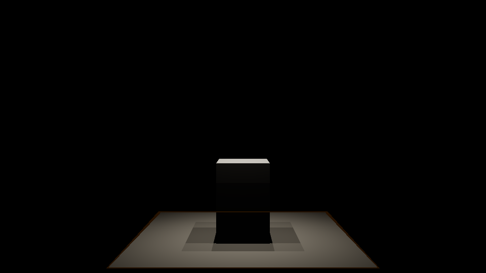

# Raster area-light shadows

Area-light visibility uses up to four complete perspective shadow cubes inside
the existing 24-layer local atlas. Each cube now represents an equal-area
emitter domain: rectangle strips/quadrants or disk sectors. CPU origins are
domain centroids; Slang integrates residual emitter area around each origin.
Unoccluded lighting uses the selected [LTC or sampled integration](ltc-area-lighting.md).
Light intensity and area conventions are preserved. Deferred, forward opaque
and forward transparent evaluation share the visibility helper.

The previous four-origin path combined nearly hard edges because multiple-origin
layers uploaded zero source radius. That produced quarter-level plateaus.
The new path searches blockers, linearizes finite perspective reverse-Z depth,
and estimates the footprint from blocker/receiver separation in emitter space.
Filter rays project onto the receiver plane and select their own cube face,
including across seams. Rectangular aspect ratio and disk boundaries remain
part of the footprint. Stable light-texel seeds and stratified subcell offsets
break aligned filter bands. The method builds on
[percentage-closer soft shadows](https://developer.nvidia.com/gpugems/gpugems3/part-ii-light-and-shadows/chapter-8-summed-area-variance-shadow-maps).

This is a raster approximation using average blocker depth and a locally planar
receiver. Multiple separated blocker depths, very near emitters and highly
nonplanar receivers can still differ from full ray visibility. The bounded
blocker search can miss very small isolated blockers. Optional
[ray-query shadows](ray-query-rendering.md) provide geometry visibility when
selected; enabling device features alone leaves the raster mode selected.

| Fixed-origin diagnostic | Balanced raster filtering |
| --- | --- |
|  |  |

## Quality and cost

Choose **Area shadow quality** in Lighting Settings or pass
`--area-shadow-quality N`:

| N | Mode | Filter taps per origin | Blocker search |
| --- | --- | ---: | --- |
| 0 | Fixed origins, diagnostic baseline | 12 small PCF taps | None |
| 1 | Fast | 16 | 16 domain taps plus up to four origin seeds |
| 2 | Balanced, default | 32 | Same |
| 3 | High | 64 | Same |

The layer budget still determines one to four complete cubes per area light;
point-light allocations take precedence. Increasing filter quality changes
sampling cost rather than atlas allocation. The existing 2048x2048x24 atlas
allocation is independent of active layers.
The atlas uses the engine's depth/stencil format: its nominal payload is 768 MiB
with D32_SFLOAT_S8_UINT, or 384 MiB with D24_UNORM_S8_UINT. Capture telemetry also
reports the actual VMA allocation size; allocation size is not GPU residency.
Additional area-visibility history memory is zero. Sampling has no frame seed
or visibility accumulation requirement; all modes work with TAA disabled.
Native TAA can further reduce filter grain under its existing color-history
rejection policy.

A separate 128-frame warmed Cornell run at 960x540, MSAA 1x, TAA/bloom/ray
queries off measured the following known GPU pass totals on the RTX 2080 SUPER:

| Mode | Deferred GPU ms | Forward GPU ms |
| --- | ---: | ---: |
| Fixed origins | 3.63 | 3.62 |
| Fast | 5.19 | 5.22 |
| Balanced | 5.58 | 5.46 |
| High | 6.65 | 6.40 |

These are timestamps for the last measured frame after warmup, not an average,
an isolated filter timer or a universal performance guarantee. Per-pass timings
and final allocation/sample telemetry are retained in
`out/shadow-review/benchmark/results.json` and its capture sidecars.

Capture telemetry records the quality, active atlas layers, total area origins,
domain blocker/filter tap budgets, atlas payload and zero extra history bytes.
The blocker-tap field describes the domain search; origin seed reads are
additional. Existing pass telemetry reports GPU timestamps for local shadow
rendering and lighting. Read GPU measurements without concurrent capture jobs.

## Independent validation

`tests/validation/area_shadow_regression.py` renders actual HDR lighting in both
techniques with ray-query device features disabled and synchronization validation
enabled. It compares multiple floor cross-sections against independent segment
intersection with a solid AABB blocker, using 128x128 and 256x256 emitter-area
integration to check convergence. A matched unoccluded capture and inverse
sRGB/ACES conversion recover shadow visibility without depending on material
brightness or exposure. No shadow filter implementation is copied into the
reference. The weighting follows the existing emitter irradiance convention.

Cases cover emitter size, height, aspect ratio, disk shape, cube seams and
transparent receivers. A plateau probe checks nine-pixel windows where the
reference changes by more than 0.06 but observed visibility changes by less than
0.025. The deliberately fixed-origin mode must fail the filtered modes' error
and plateau improvement gates. Source/caster geometry and bounce intensity stay
fixed; no whole-image blur or tolerance change masks the defect.

Moving-occluder and edited-area-light sequences compare TAA off/on during motion
and after it stops, including static convergence. `areaLightPosition` capture
events edit the first area light through the normal editable-light API, and
telemetry verifies that the submitted position changed. The last sequence frame
uses the main screenshot filename; earlier sampled frames have numbered names.

```powershell
cmake --build out/build/visual-studio --config Release --target VulkanSceneRenderer lighting_shadow_sampling_tests temporal_capture_tests rendering_convention_tests
$env:CONTAINER_RUN_GPU_AREA_SHADOW = '1'
ctest --test-dir out/build/visual-studio -C Release -R '^area_shadow_gpu_regression$' --output-on-failure
```

Captures, profiles and measurements are written under
`out/build/visual-studio/test_results/area-shadows/`. The original Cornell capture
is retained locally as `out/shadow-review/before-deferred.png`. The historical
Cornell golden and its tolerances remain unchanged; its comparison is reviewed
separately from the independent visibility reference and region probes.

Verified on 2026-10-05 with the native Visual Studio Release build and RTX 2080
SUPER: all 48 static mode/case/technique profile records and 24 motion comparisons
pass. The 256x256 reference differs from 128x128 by at most 0.00197 mean
visibility. Fixed-origin penumbra MAE is 0.0962--0.1268, versus
0.0092--0.0166 for balanced and 0.0076--0.0161 for high. Eligible plateau fractions
reach 1.0 with fixed origins; balanced is at most 0.05 and high is zero.
Fast mode MAE is 0.0140--0.0208. Moving-light/blocker TAA RGB MAE is at most
0.00310 during motion and 0.00164 after stopping, with P95 at most 2/255.
All captures pass Vulkan and synchronization validation with ray queries disabled.
The historical Cornell golden has not been replaced by these reference fixtures.

The final Cornell capture reports 805,306,368 bytes (768 MiB) for both nominal
atlas payload and the actual VMA allocation on this GPU. All original contact,
softness and wall-colour probes pass. Its historical golden comparison remains
a failure: MAE 0.004761, P95 0.01402 and different-pixel fraction 0.33182 versus
the unchanged 0.01 limit. Before filtering, the recorded different-pixel fraction
was 0.3319 (MAE 0.00360). Those historical values and the original reference are
retained; the independent visibility profiles establish the new filter's
improvement without replacing a failed comparison with a passing claim.
