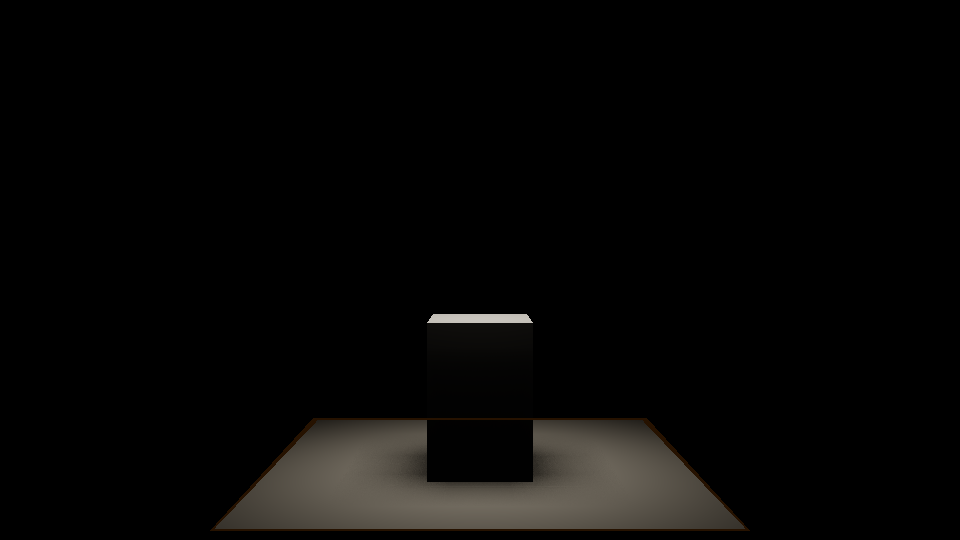
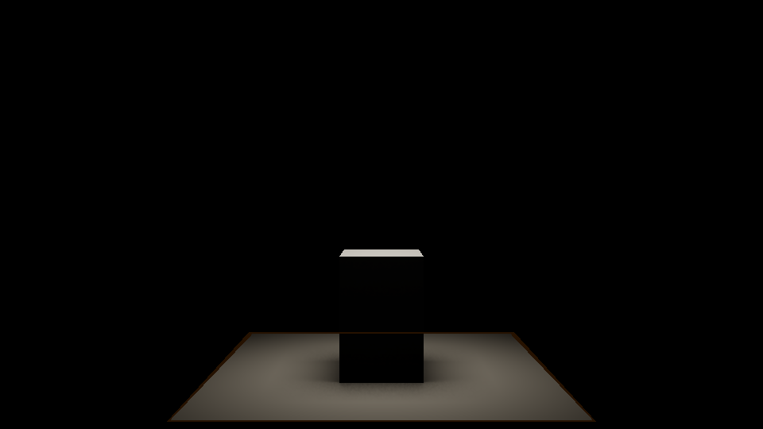

# Optional ray-query shadows

Both forward and deferred rendering can use geometry-based shadow visibility.
`--ray-shadows hard` traces a directional ray and selected point/spot lights;
area lights use their centre. `--ray-shadows soft` samples rectangle and disk
emitters and filters their visibility with independent temporal/spatial history.
The default remains raster shadows.

```powershell
.\VulkanSceneRenderer.exe --ray-shadows soft --ray-shadow-samples 8 --display-mode lit
.\VulkanSceneRenderer.exe --render-technique forward-raster --ray-shadows hard
.\VulkanSceneRenderer.exe --ray-shadows soft --no-ray-query
```

The last command exercises the unsupported-device raster route. Vulkan 1.4 does
not itself imply ray support. The device must expose
`VK_KHR_acceleration_structure`, `VK_KHR_ray_query`,
`VK_KHR_deferred_host_operations`, enabled buffer device addresses and both
extension feature bits. Missing optional features preserve raster device
selection. The separate trace compute module and optional forward ray fragment
module require `spvRayQueryKHR`; unsupported devices never create their pipelines.
The baseline lighting modules read a visibility texture without requiring ray
capabilities.

## Quality and diagnostics

- `--ray-shadow-samples`: 1–32 emitter samples per selected area light; default 8.
- `--ray-shadow-light-budget`: 0–8 local lights; default 8. Up to the first four
  point/spot lights are selected, then up to four area lights use the remaining
  budget. Remaining lights use their existing raster shadows. Directional
  visibility has a separate single-ray budget.
- `--no-ray-shadow-denoise`: show current sampled visibility without filtering.
- `--ray-shadow-debug-layer`: 0 shaded; 1 directional; 2–5 point/spot;
  6–9 area-light visibility; 10 configured sampling budget. Budget RGB encodes
  emitter samples / 32, selected local lights / 8 and the directional query.

The Shadows UI offers the same controls, capability/fallback status, allocated
memory, BLAS build/reuse counts and instance counts. The GPU pass profiler shows
`RaySceneBuild`, `RayShadowTrace` and `RayShadowFilter`. Capture telemetry includes
`rayShadows`, actual VMA allocation sizes, retained generation memory and reset
counts. Timestamp results describe completed GPU work; an unchanged scene's build
pass does no AS work. Capture a dynamic sequence to measure TLAS rebuilding.

The highest budget is 1 directional + 4 point/spot + 4 × 32 area rays per covered
pixel. Zero-intensity and out-of-range local lights skip queries; emitter samples
with zero contribution skip traversal too. The budget view
shows the configured limit, rather than a hardware traversal-instruction count.

## Shared scene and lifetime contract

`RaySceneAcceleration` is a reusable BLAS/TLAS service, independent of shadow
shading. `RaySceneExtraction` adapts primary glTF and auxiliary BIM/USD indexed
triangles to its checked input contract. Provider-local draw ranges identify
geometry; repeated instances share a BLAS. Only referenced vertices are compacted,
and triangle metadata retains both UV sets. Extraction precedes camera/frustum,
Hi-Z and drawing-budget culling, so off-screen geometry still blocks rays.
Semantic object/layer visibility and section/box clipping remain effective.
Native point and polyline primitives have no triangle shadow representation.

Providers advance geometry revisions on changed positions/indices or reloads.
Geometry changes rebuild affected BLAS; transforms, visibility and sidedness
build a new TLAS while matching BLAS are reused. Validation rejects invalid
indices, nonfinite positions, duplicate provider identities and singular or
nonaffine transforms before recording. Empty scenes build valid empty TLAS.

Compact geometry and triangle UV metadata are cached independently of instance
transforms and material assignments. Transform-only updates refresh instances
without compacting the meshes again. Generations share the immutable GPU
triangle metadata through fence retirement; replacement geometry invalidates
the cache and the corresponding acceleration data. Source-buffer identity is
tracked per provider, so adding or replacing one provider preserves BLAS reuse
for unchanged providers, including BIM geometry when a mesh primitive is added.

Each immutable generation owns its TLAS, VMA input/scratch/storage allocations,
BLAS references and material metadata. Frame slots retain generations through GPU
fence retirement. Shared allocations are counted once in aggregate telemetry.
The device and allocator outlive all generations; AS handles are destroyed before
their VMA backing buffers. Builds, compute queries and filters run outside dynamic
rendering; optional forward fragment queries run inside the opaque rendering pass.
All use the graphics queue with synchronization2 dependencies. The service
adds no queue/device idle to normal updates. Existing reload/resize retirement
protects replacement resources. Failed recording/submission must abandon the
command buffer before releasing its generation.

Vulkan's row-major 3×4 instance ABI is populated explicitly from GLM transforms.
Engine GLM-to-Slang uploads remain column-major. Mirrored instances receive no
extra winding flip because Vulkan tests facing in object space. Double-sided
materials disable triangle facing culling.
Visibility rays travel from receiver to light, so they cull query-front faces
to match the raster shadow camera's back culling in the opposite direction.

## Materials and supported shadow policy

Non-opaque candidates allow hit-level section and box clipping. Solid surfaces
commit immediately after clipping. Alpha masks interpolate triangle UV0/UV1,
apply the shared texture transforms and samplers, combine material alpha,
opacity factors and opacity texture channels, and compare the material cutoff.
Inline queries sample mip zero because raster derivatives are unavailable.
Raster coverage dithering at antialiased mask edges therefore differs; mask
interiors, transforms, UV selection and cutoff conventions are shared.

Blended and transmissive blockers do not cast binary ray shadows. Transparent
receivers retain raster visibility because their depth layers differ from the
opaque visibility buffer. This policy does not approximate coloured transmission
or volumetric attenuation. Height-displaced materials trigger a complete raster
fallback until displaced vertex positions can be shared with AS builds; the UI
reports that fallback rather than tracing the undeformed mesh.

Forward MSAA pixels may cover several receivers while the ray visibility image
stores the receiver selected by resolved reverse-Z depth. Forward fragments
compare their depth and full ray origin with that receiver before reading hard
or unfiltered visibility. The raster sample address must agree too: a different
point on the same plane can lie across a thin blocker's shadow edge. Matching
fragments retain buffered ray shadows; other covered fragments trace visibility
from their own world position and geometric normal. An optional forward fragment
shader uses the same inline-query material, clipping and emitter-sampling policy
as the compute pass. This remains correct when a selected local light has no
raster atlas allocation. Devices with ray queries disabled use the original
raster shader and pipelines.

With soft-shadow denoising enabled, a sloped MSAA surface can have a different
fragment-centre depth from the resolved sample even when the pixel covers one
receiver. On devices with standard 2x, 4x, 8x or 16x sample locations, camera
queries verify the receiver instance, triangle plane and resolved depth before
reusing filtered visibility. Tracing reconstructs depth at the selected sample
position: SAMPLE_ZERO uses sample zero, while MAX uses the depth gradient of a
consistent planar neighbourhood. Forward reuse also verifies that this exact
trace origin lies on the fragment's plane. Mixed receivers, ambiguous coverage,
inconsistent depth gradients and unknown sample layouts retain the conservative
per-fragment query path.
Receiver verification adds a camera-centre query and one query per MSAA sample
when a standard MSAA receiver needs filtered area visibility. Disabled area
emitters skip that verification as well as emitter queries.

## Visibility history

Only soft emitter visibility is filtered. Exact directional, point and spot
visibility is preserved, including thin blockers. The temporal pass reconstructs
current world position from reverse-Z depth, reprojects with the last submitted
jittered camera matrix, tests depth/normal compatibility and clamps history to a
compatible current neighbourhood. A subsequent spatial pass filters compatible
neighbours. Depth derivatives select the nearer valid neighbour on each axis to
avoid crossing silhouettes or background pixels.
MSAA tracing, normal derivatives and history reconstruction use the same resolved
sample position. Filtering also checks world-space plane compatibility so close
parallel receivers cannot exchange visibility merely because their normals and
depth values are similar.

A receiver narrower than one pixel cannot always supply valid depth neighbours
for both normal derivatives. Derivatives that span incompatible depth surfaces
are rejected; an unreliable normal requests a conservative query bias instead
of a camera-facing normal offset that could move the ray into the receiver.

Geometry/transforms, semantic visibility, materials, lights, clipping and quality
changes invalidate the entire visibility history. This conservative policy avoids
reusing illumination from moving blockers or lights. Camera motion reprojects
static surfaces; visibility history operates with TAA disabled too. Only a
successfully submitted frame advances history. Raster mode and resize invalidate
history; visibility resources remain alive across mode switches until frame
retirement. TAA keeps its separate scene-linear colour history.
Changing ray mode, sample/light budgets, filtering or debug output also resets
TAA colour history before the frame snapshot is created.

## Validation and costs

```powershell
$env:CONTAINER_RUN_GPU_RAY_QUERY = '1'
$env:CONTAINER_RUN_GPU_RAY_SHADOW = '1'
ctest --test-dir out/build/visual-studio -C Release --output-on-failure -R 'ray_scene|ray_shadow_gpu'
```

The backend probe checks real sided/mirrored/scaled/distant traversal, masks,
finite rays, candidate rejection, BLAS reuse and old-generation lifetime. Runtime
captures compare shadows against independent segment/box or plane intersections
and converged emitter integration. They also exercise textured UV1 cutouts,
off-screen/thin blockers, motion, sample/filter budgets, empty scenes, glTF/BIM/
USD/IFC reloads, mode/technique changes, MSAA, resize and TAA. GPU tests require a
validation layer and skip unsupported ray traversal rather than treating it as a
passed quality comparison.

960×540 measurements on RTX 2080 SUPER (Visual Studio Release,
2026-10-06): rectangle/disk penumbra mean absolute visibility error 0.0062–0.0116
against 256×256 independent emitter integration; hard point mismatch 0; forced
raster fallback pixel-identical in both techniques. With 32 emitter samples,
query time was 0.70–0.79 ms and filtering 0.47–0.74 ms. The seven-instance fixture used
20,480 bytes AS storage, 4,096 bytes input and 14,848 bytes retained scratch;
all live allocations including visibility/history images totalled 108,177,616
bytes. These are actual VMA allocations rather than requested payload sizes.
Image cost scales with resolution and layer allocation alignment. Measurements
are fixture/device-specific; raster shadow atlases remain allocated for fallback
lights and transparent receivers.

The complete runtime suite passed 138 evidence records in 319 seconds, including
0.3 m, 0.8 m and 1.4 m emitters. At eight samples, filtering reduced penumbra
error from 0.1057–0.1059 to 0.0147–0.0149. A continuously moving blocker reused all
seven BLAS while rebuilding TLAS: GPU build time 0.054–0.058 ms, queries
0.750–0.760 ms and filtering 0.451–0.461 ms. Retaining the in-flight generations
raised total allocations to 108,189,936 bytes. Geometry/light changes rejected
history immediately; settled visibility error was below 0.016. Validation and
synchronization checks stayed clean across all lifecycle captures.

The targeted receiver-artifact regressions can also be run independently:

```powershell
$env:CONTAINER_RUN_GPU_RAY_SHADOW = '1'
python -B tests/validation/ray_shadow_regression.py --exe out/build/visual-studio/Release/VulkanSceneRenderer.exe --output out/review-ray-receiver-artifacts --case artifacts
python -B tests/validation/ray_shadow_regression.py --exe out/build/visual-studio/Release/VulkanSceneRenderer.exe --output out/review-ray-msaa --case msaa
python -B tests/validation/ray_shadow_regression.py --exe out/build/visual-studio/Release/VulkanSceneRenderer.exe --output out/review-ray-msaa-hard --case msaa-hard
```

These cases measure the red foreground and green background contributions of a
mixed 4x MSAA pixel against an unblocked capture, including selected point and
area lights without a raster atlas fallback, check fully covered interiors
at 1x and 4x, and require an unblocked one-pixel grazing receiver to retain white
visibility and its raster-reference lighting in both techniques. Disabled area
lights must return white visibility over pixels that the enabled emitter
shadowed. This group is included in the full runtime suite; its results are
written to its own `results.json` and are separate from the measurements above.
The MSAA group also compares filtered and raw eight-sample penumbrae at 1x, 2x,
4x and 8x against independent emitter integration, skipping optional sample
counts that the device cannot provide. Close parallel receivers exercise both
separate instances and two planes within one instance; a grazing area emitter
checks mixed pixels and fully covered shadowed interiors.
The MSAA group includes a moving-camera sequence; `--case msaa-motion` runs only
that sequence. `--case msaa-hard` isolates thin hard shadows on flat and shallow
receivers under directional, point and area lights at 1x, 2x, 4x and 8x. An
independent camera-ray/blocker intersection checks both the blocked centre strip
and the adjacent lit pixels against clear captures. This group is also included
in the full runtime suite and the `artifacts` and `msaa` cases.

The hard-shadow receiver fix passed all 24 light/slope/MSAA combinations. Each
capture retained all 32 analytically blocked pixels and all 160 adjacent lit
pixels. The blocked-to-clear lighting ratio was 0.0125 at the 95th percentile;
the adjacent lit pixels matched their clear reference. Before the fix, 2x and
4x MSAA lost the entire blocked strip in the flat directional-light fixture.
The targeted `msaa` run passed all 57 evidence records: these 24 hard-shadow
comparisons, 17 receiver-artifact checks, eight camera-motion frames and eight
filtered/raw penumbra comparisons. All 98 capture logs remained free of
validation and synchronization errors; soft-shadow quality stayed unchanged.

The 2026-10-07 MSAA receiver run reduced eight-sample penumbra mean absolute
visibility error from 0.1057 without filtering to 0.0147, 0.0151, 0.0156 and
0.0159 at 1x, 2x, 4x and 8x respectively. A grazing area-light fixture with
receivers 3 mm apart retained correct lighting for every checked mixed pixel and
all 3,843 blocked background interior pixels, with both separate instances and
two planes in one instance. Both filtered and raw visibility passed these checks.
In the 960×540 tilted fixture, one settled 4x capture measured 0.38 ms forward
lighting, 0.56 ms ray tracing and 0.59 ms filtering on RTX 2080 SUPER. These
single-capture timings describe this fixture, rather than a general frame cost.
A separate 4x camera-motion run passed all eight captured frames. Settled
visibility error remained 0.0148–0.0160 against independent emitter integration,
with clean validation and synchronization checks.

The earlier 2026-10-07 Release run passed all 163 runtime evidence records, including
17 receiver-artifact checks and eight MSAA quality comparisons, with no
validation or synchronization errors.
The mixed-receiver tests retained fully lit foregrounds while the blocked
background contribution stayed below 0.027 at the 95th percentile. Both grazing
receivers matched their unshadowed raster lighting, and disabled emitters returned
full visibility. All six targeted CTest suites and Vulkan 1.4 SPIR-V validation
of the four affected shader modules passed.

On Ryzen 9 3900X, a one-million-triangle, 1,000-instance CPU fixture measured
114.0 ms median full extraction versus 0.43 ms for the production cache's
transform-only update. This measures extraction and instance validation; backend
geometry validation and GPU acceleration-structure work are excluded.

The same isolated rectangle-light fixture, with matched exposure and camera:

| Raster area shadows | Ray-query area shadows, 32 samples and filtering |
| --- | --- |
|  |  |

Runtime evidence is written to `out/build/visual-studio/test_results/ray-shadows`.
The Windows packaging script includes the ray compute and optional forward ray
fragment SPIR-V files. The package
smoke runner verifies extracted forward/deferred queries and forced fallback
from an unrelated directory with SDK/build-tool environment paths removed.

See [epic #41](https://github.com/semihguresci/VulkanSceneRenderer/issues/41),
[coordinate conventions](coordinate-conventions.md), the
[Khronos ray-query sample](https://docs.vulkan.org/samples/latest/samples/extensions/ray_queries/README.html)
and [Slang inline queries](https://docs.shader-slang.org/en/stable/external/core-module-reference/types/rayquery-03/tracerayinline-058.html).
